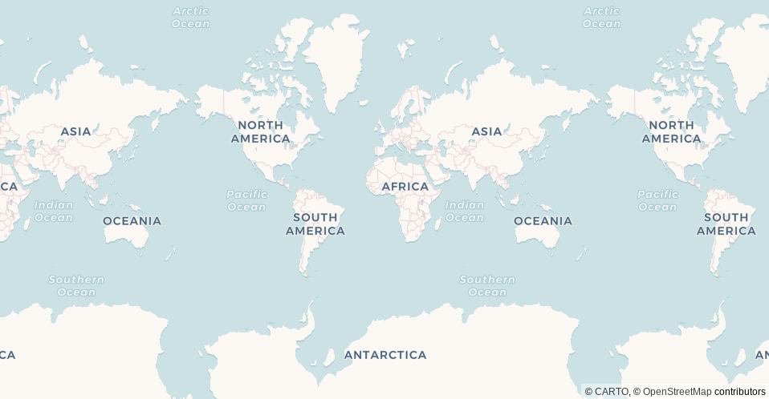
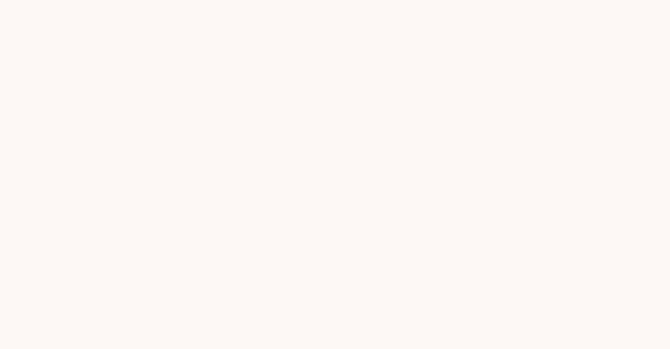
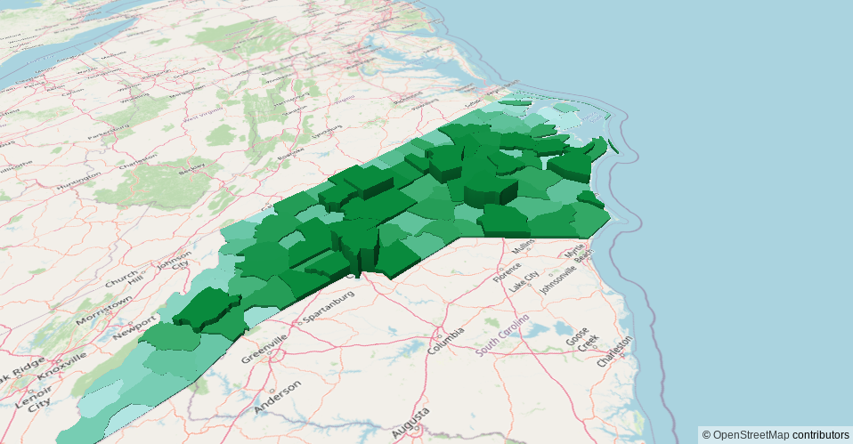

<!-- README.md is generated from README.Rmd. Please edit that file -->

```{r, include = FALSE}
knitr::opts_chunk$set(
  collapse = TRUE,
  comment = "#>",
  fig.path = "man/figures/README-",
  out.width = "100%"
)
```

# blaeu

<!-- badges: start -->
<!-- badges: end -->

**blaeu** is a web mapping framework for R built on top of [MapLibre GL](https://github.com/maplibre/maplibre-gl-js).

## Installation

You can install the development version of blaeu from [GitHub](https://github.com/) with `devtools` or `pak`:

``` r
# install.packages("devtools")
devtools::install_github("program--/blaeu")

# install.packages("pak")
pak::pkg_install("program--/blaeu")
```

## Example

Creating a map with a basemap:

```{r example, eval = FALSE}
# Creating map
blaeu::map(style = blaeu::carto("voyager"))
```



**blaeu** currently has functions for adding:

Function                 | Description
------------------------ | ---
`blaeu::openstreetmap()` | OpenStreetMap *raster* basemap tiles,
`blaeu::stamen()`        | Stamen Watercolor, Terrain, and Toner *raster* basemap tiles,
`blaeu::carto()`         | Carto Dark Matter, Voyager, and Positron *vector* basemap tiles.

Adding points with `sf` objects:
```{r sf_example, eval = FALSE}
# Setting up example data
example_data <- quakes
example_data$long <- ifelse(
  example_data$long > 180,
  example_data$long - 360,
  example_data$long
)

example_data <- sf::st_as_sf(
  example_data,
  coords = c(2, 1),
  crs = 4326
)

blaeu::map(style = blaeu::carto("voyager")) |>
  blaeu::map_source(example_data, id = "quakes") |>
  blaeu::map_layer(
    id = "pts",
    source = "quakes",
    type = "circle",
    # blaeu includes `paint_*` functions that make it
    # easy to define how your layer should be visualized
    paint = paint_circle(
      # MapLibre GL expressions are supported by using
      # R Lists in place of JS Arrays
      color = c(
        list(
          "interpolate",
          list("linear"),
          list("get", "mag")
        ),
        rbind(
          as.list(seq(from = 0, to = 5)),
          as.list(substr(viridisLite::inferno(6), 1, 7))
        )
      ),
      blur = 0.2,
      radius = list("^", list("get", "mag"), 1.25)
    ),
    # Popups are easy to create if only simple HTML is needed.
    # Data properties can be included via string interpolation
    # by using `${VARNAME}`, where VARNAME is the property.
    popup_text = "<strong>Magnitude</strong>: ${mag}"
  )
```



All MapLibre GL layers are supported, including fill extrusions:
```{r 3d_example, eval = FALSE}
blaeu::map(style = blaeu::openstreetmap()) |>
  blaeu::map_source(
    sf::st_transform(
      sf::read_sf(system.file("gpkg/nc.gpkg", package = "sf")),
      4326
    ),
    id = "nc"
  ) |>
  blaeu::map_layer(
    id = "b",
    source = "nc",
    type = "fill-extrusion",
    paint = paint_fill_extrusion(
      height = list("get", "BIR79"),
      color = list(
        "interpolate",
        list("linear"),
        list("get", "BIR79"),
        0,
        "#edf8fb",
        319,
        "#b2e2e2",
        1308,
        "#66c2a4",
        2636,
        "#2ca25f",
        4989,
        "#006d2c"
      )
    ),
    popup_text = "Number of Births (1979): ${BIR79}"
  )
```




### PMTiles Support

**blaeu** also has support for PMTiles:

```{r pmtiles, eval = FALSE}
blaeu::map() |>
  blaeu::map_source(
    x = "https://some/url/to/tiles.pmtiles",
    type = "pmtiles",
    id = "my-pmtiles-source",
    # Maxzoom must be specified, otherwise
    # the features will disappear after
    # passing the maximum zoom
    maxzoom = 10
  ) |>
  blaeu::map_layer(
    id = "my-pmtiles-layer",
    source = "my-pmtiles-source",
    source_layer = "my-pmtiles-source-layer",
    type = "line",
    paint = blaeu::paint_line(color = "blue")
  )
```

## Development

**blaeu** uses:

- [TypeScript](https://www.typescriptlang.org/) in place of Javascript,
- [yarn](https://yarnpkg.com/) for package management,
- [Vite](https://vitejs.dev/) for building/bundling.

All TS code is located within the `typescript/` directory.

To build out the current TS code, navigate to the `typescript/` directory and run:

```
yarn build
```

This will build, bundle, and push the TS code to `inst/htmlwidgets/blaeu.js`, which is the primary
interface to R's HTMLWidgets package.

## License

**blaeu** itself is [MIT](https://opensource.org/licenses/MIT)-licensed.

However, MapLibre GL has a [3-Clause BSD](https://opensource.org/licenses/BSD-3-Clause) license.
Its license and dependency licenses are found [here](inst/htmlwidgets/lib/maplibre-gl-2.1.1/LICENSE).